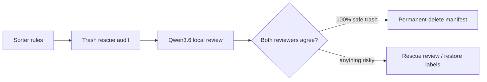

# 🧭 Decision Log

Updated: 2026-07-05

## What This Project Is Optimized For

Gmail Sorter is built around conservative cleanup. The sorter can identify low-value mail quickly, but every destructive path should have visible reports, manifests, and explicit flags.

## Mail Cleanup Decisions

| Question | Decision | Reasoning |
| --- | --- | --- |
| Should the sorter permanently delete directly from scan results? | No. | It stages labels/archive/trash first, then uses rescue audits before permanent delete. |
| Should local AI see Gmail directly? | No. | The local model receives bounded JSONL review packets or local server calls, not Gmail credentials. |
| Should generated reports be committed? | No. | They can contain private mail metadata and are ignored by Git. Only `.gitkeep` placeholders stay. |
| Should `coder-big` remain the default profile? | No. | The active local review profile is now `qwen36`, matching the upgraded local AI stack. |
| Should old resume/tomorrow command notes stay? | No. | They were one-off operational notes and were removed from Git. |

## AI Review Stack

The sorter uses Qwen3.6 for local mailbox review because this is an implementation/review task with bounded inputs. The broader local AI stack keeps Gemma 4 as a planner/architect model and DeepSeek 32B as a reasoning fallback.

The companion AI stack repo is `https://github.com/Rad-ops/local-ai-coding-stack`. It keeps the model profiles, install notes, and benchmark CSVs. This repo keeps the Gmail policy and workflow code.

Live Gmail Sorter workload recorded there:

- Qwen3.6 reviewed 6,531 bounded Trash rescue rows.
- The run processed 10,309,912 prompt tokens and 846,873 generated tokens.
- The averaged llama.cpp timing was 549.96 prompt tok/sec and 90.92 generation tok/sec.
- Weighted draft-token acceptance was 85.03%.

## Local Cleanup Decisions

Generated local folders were cleaned after the mail cleanup finished:

- `reports/`
- `manifests/`
- `data/`
- `__pycache__/`
- `.pytest_cache/`

The repository keeps only placeholder `.gitkeep` files in generated-output directories.
